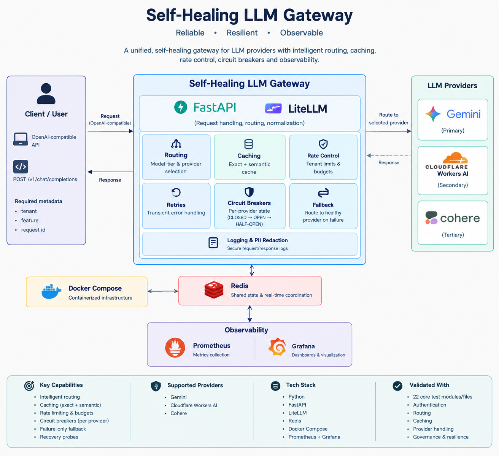

# Self-Healing LLM Gateway

A production-minded LLM gateway designed to provide a reliable infrastructure layer between applications and multiple LLM providers.

The gateway provides a single OpenAI-compatible API while handling provider routing, caching, tenant controls, failure recovery, and operational observability.

The main goal of the project is to make LLM applications more resilient without requiring each application to implement its own provider-specific reliability and governance logic.

---

## Why This Project?

LLM applications depend on external model providers, which can introduce several operational problems:

- Temporary provider failures
- Rate limits
- Increased latency
- Repeated requests for similar prompts
- Uncontrolled tenant usage
- Provider-specific API differences
- Difficulty identifying where failures occur

Instead of handling these concerns independently inside every application, this project places them inside a centralized gateway.

The application communicates with one gateway API, while the gateway manages the underlying LLM infrastructure.

---

## Key Capabilities

### OpenAI-Compatible Gateway

The gateway exposes:

`POST /v1/chat/completions`

using an OpenAI-compatible request structure, making it easier for applications and clients to integrate without implementing provider-specific request formats.

### Multi-Provider LLM Support

The gateway currently supports:

- Google Gemini
- Cloudflare Workers AI
- Cohere

LiteLLM is used to normalize communication with the configured providers.

### Intelligent Request Routing

Requests can be routed according to the configured model and model-tiering logic.

This allows simpler requests to use appropriate models while keeping the routing logic centralized inside the gateway.

### Exact Response Caching

Identical requests can be served from Redis instead of making another LLM provider request.

This reduces unnecessary provider calls and can improve response latency.

### Semantic Caching

The gateway also supports semantic cache lookup.

Requests that are sufficiently similar to a previously processed request can reuse an existing response instead of generating another provider request.

Embeddings are used to determine semantic similarity.

### Tenant-Aware Rate Limiting

Redis-backed rate limiting controls request volume for individual tenants.

This prevents a single tenant or application feature from continuously consuming gateway resources.

### Tenant Budgets

The gateway tracks usage against configured tenant budgets.

Requests can be rejected when a tenant reaches its configured usage limit.

### Provider Circuit Breakers

Provider-specific circuit breakers prevent repeated requests from being sent to an unhealthy provider.

The circuit breaker state is stored in Redis so provider health information can be shared across gateway instances.

### Failure-Only Provider Failover

The gateway does not switch providers unnecessarily.

When a provider request fails and recovery logic determines that the failure requires another provider, the gateway can continue through the configured provider chain.

This allows an application request to succeed even when an individual provider is unavailable.

### Retry and Recovery

Transient provider failures can be handled through retry and recovery logic before moving to another provider.

The system also records retry and provider recovery activity through Prometheus metrics.

### Secure Authentication

The gateway uses tenant-aware Bearer authentication.

Gateway API keys are:

- Loaded from environment configuration
- Associated with tenants
- Compared using constant-time comparison
- Never intended to be stored in source control

Invalid credentials are rejected before the request reaches the LLM provider layer.

### PII Redaction

Application logging includes recursive redaction for sensitive information such as:

- API keys
- Authorization headers
- Tokens
- Passwords
- Email addresses
- IP addresses
- Phone numbers
- Credit-card-like values

The goal is to keep operational logs useful without unnecessarily exposing sensitive information.

---

## Request Processing

A request passes through several gateway controls before reaching an LLM provider.

The gateway first authenticates the request and validates the tenant.

Rate limits and budget controls are then applied.

The gateway determines the appropriate model/provider and checks the exact response cache followed by the semantic cache when enabled.

If a cached response is unavailable, the request is sent to the provider.

A successful provider response can be stored in the caches and returned to the application.

If the provider fails, the gateway applies its retry, circuit-breaker, and failover logic before attempting another healthy provider when appropriate.

This keeps reliability logic inside the infrastructure layer rather than inside every application using the gateway.

---

## Self-Healing Validation

The recovery mechanism was validated using a separate development gateway instance with controlled Gemini failure injection.

A request targeting Gemini was intentionally made to fail.

The gateway detected the provider failure and successfully continued through the provider fallback path.

The final request returned:

- HTTP `200`
- A successful Cloudflare provider response
- The Cloudflare model `@cf/meta/llama-3.1-8b-instruct-fp8`

The same recovery event was visible through the Grafana dashboard using metrics for:

- Gemini failures
- Provider failures
- Provider failovers
- Cloudflare fallback success
- Successful gateway requests
- Gateway latency
- Provider latency

This validated both the recovery mechanism and the observability layer.

Failure injection is restricted to development environments and is explicitly blocked in production.

---

## Observability

Prometheus collects gateway and provider metrics, while Grafana provides the operational dashboard.

The monitoring layer includes visibility into:

### Gateway Performance

- Request rate
- Successful requests
- Request latency
- P95 gateway latency

### Provider Performance

- Provider requests
- Provider failures
- Provider health
- Provider latency
- P95 provider latency

### Self-Healing

- Provider failures
- Provider failovers
- Retry attempts
- Successful recovery through fallback providers

### Caching

- Exact cache hits
- Semantic cache activity
- Cache misses
- Cache hit rate

### Governance

- Rate-limit rejections
- Budget rejections

### Infrastructure

- Redis connectivity and health

This makes it possible to observe not only whether the gateway is working, but also how it behaves under failure and recovery conditions.

---

## Production Hardening

The project includes several protections intended to separate development testing from production behaviour.

Production mode:

- Disables failure-injection endpoints
- Rejects startup when failure-injection flags are enabled
- Keeps provider credentials outside source control
- Redacts sensitive information from logs
- Returns sanitized errors to clients
- Uses Redis-backed state for shared controls
- Runs through Docker Compose for reproducible deployment

The production environment therefore cannot accidentally expose the development failure-injection mechanisms used for resilience testing.
## Architecture


---

## Technology Stack

| Category | Technology |
|---|---|
| Programming Language | Python |
| API Framework | FastAPI |
| LLM Abstraction | LiteLLM |
| Cache & Shared State | Redis |
| Containerization | Docker |
| Orchestration | Docker Compose |
| Metrics | Prometheus |
| Visualization | Grafana |
| Testing | Pytest |
| Dependency Management | uv |

### LLM Providers

- Google Gemini
- Cloudflare Workers AI
- Cohere

---

## Running the Project

### Clone the repository

```bash
git clone https://github.com/Deepthi-0411/self-healing-llm-gateway.git
cd self-healing-llm-gateway
Configure environment variables

Create a .env file containing the required provider credentials and gateway configuration.

Do not commit .env or expose API keys.

Start the infrastructure
docker compose up --build -d

The Docker Compose stack runs the gateway together with Redis, Prometheus, and Grafana.

Default local endpoints:

Gateway: http://localhost:8000
Prometheus: http://localhost:9090
Grafana: http://localhost:3000
Testing

Run the automated test suite with:

uv run python -m pytest -v

Current automated test result:

8 tests passed

The project was also manually validated for:

Authentication
Tenant authorization
Provider routing
Exact caching
Semantic caching
Rate limiting
Budget enforcement
Provider failure handling
Provider failover
Redis connectivity
Production failure-injection protection
Prometheus metrics
Grafana observability
Project Structure
self-healing-llm-gateway/
├── app/
│   ├── cache/
│   ├── gateway/
│   └── llm/
├── prometheus/
├── tests/
├── Dockerfile
├── docker-compose.yml
├── main.py
├── pyproject.toml
├── uv.lock
├── PRODUCTION_VALIDATION.md
└── README.md
Engineering Focus

The project was built with an infrastructure-first approach.

The focus was not simply on connecting an application to an LLM provider, but on building the reliability and operational layer around LLM usage.

The main engineering concerns addressed by the project are:

Reliability — Continue serving requests when an individual provider fails.

Performance — Reduce unnecessary provider calls through exact and semantic caching.

Governance — Control tenant request volume and usage budgets.

Resilience — Use circuit breakers, retries, provider health, and failure-only failover.

Security — Protect credentials and redact sensitive information from logs.

Observability — Make gateway behaviour, provider health, failures, recovery, and latency measurable.

The result is a reusable infrastructure layer that applications can depend on instead of implementing these concerns independently.

Future Improvements

Potential areas for further development include:

Adaptive routing based on latency and cost
More advanced provider health scoring
Distributed gateway deployment
Distributed tracing
SLO/SLA monitoring
Automated provider recovery policies
More sophisticated cost-aware routing

Author
Deepthi M

AI/ML • Generative AI • LLM Infrastructure • Machine Learning
